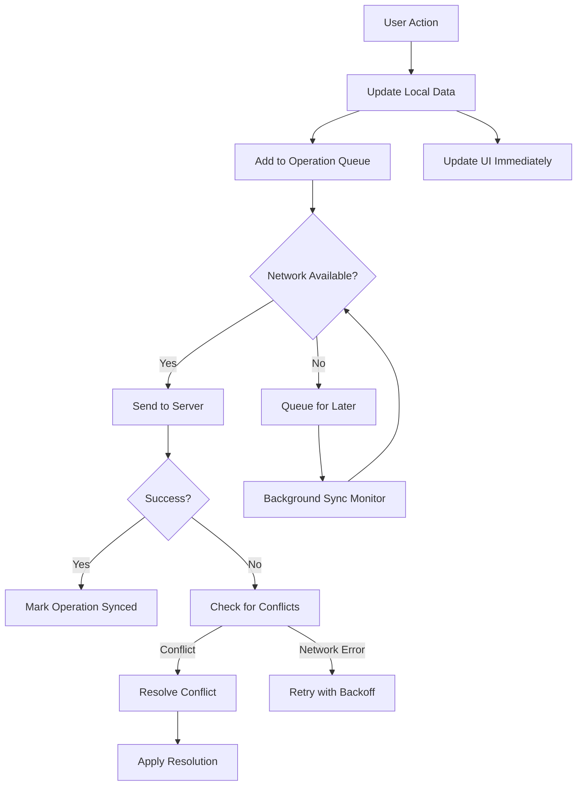

# Offline-First Sync Architecture for Footprint Travel Tracker

## Architecture Philosophy

**"Local-first, eventually consistent"** architecture that prioritizes user experience over perfect data consistency. The app functions seamlessly offline and synchronizes intelligently when connectivity is available, with robust conflict resolution for concurrent edits.

## Core Principles

1. **Local Storage as Source of Truth**: All user interactions work with local data immediately
2. **Optimistic Updates**: Changes appear instantly in the UI, then sync in background
3. **Conflict Resolution**: Intelligent merge strategies for concurrent edits
4. **Progressive Sync**: Critical data syncs first, then detailed metadata
5. **Resilient Recovery**: Automatic retry with exponential backoff for failed operations

## System Components

### iOS Client Architecture

```swift
// Core Sync Components
class SyncManager {
    private let localDatabase: LocalDatabase
    private let operationQueue: SyncOperationQueue
    private let conflictResolver: ConflictResolver
    private let networkManager: NetworkManager

    func performOperation(_ operation: SyncOperation) async
    func startBackgroundSync()
    func handleConnectivityChange(_ connected: Bool)
}

class LocalDatabase {
    private let swiftDataContainer: ModelContainer
    private let operationLog: OperationLog

    func save<T: PersistentModel>(_ model: T) async throws
    func addPendingOperation(_ operation: SyncOperation) async
    func markOperationSynced(_ operationId: String) async
}
```

### Data Flow Architecture



## Local Data Management

### SwiftData Models with Sync Metadata

```swift
@Model
final class VisitedPlace {
    // Core data
    var userID: String
    var regionType: String
    var regionCode: String
    var regionName: String
    var visitedDate: Date?
    var notes: String?

    // Sync metadata
    var syncStatus: SyncStatus = .pending
    var syncVersion: Int = 1
    var lastModifiedAt: Date = Date()
    var operationID: String = UUID().uuidString
    var deviceID: String
    var isDeleted: Bool = false

    // Conflict resolution
    var conflictResolution: ConflictResolutionStrategy?
    var hasConflict: Bool = false
}

enum SyncStatus: String, CaseIterable {
    case pending = "pending"
    case syncing = "syncing"
    case synced = "synced"
    case conflict = "conflict"
    case error = "error"
}
```

### Operation Queue Design

```swift
@Model
final class SyncOperation {
    var id: String = UUID().uuidString
    var operationType: OperationType
    var entityType: String
    var entityID: String
    var operationData: Data // JSON encoded changes
    var deviceID: String
    var createdAt: Date = Date()
    var attempts: Int = 0
    var lastAttemptAt: Date?
    var status: SyncOperationStatus = .pending
    var error: String?
    var priority: Int = 0 // Higher = more important
}

enum OperationType: String, CaseIterable {
    case create, update, delete, batchCreate, batchUpdate, batchDelete
}

enum SyncOperationStatus: String, CaseIterable {
    case pending, inProgress, completed, failed, cancelled
}
```

## Conflict Resolution Strategies

### 1. Last-Write-Wins (Default)
```swift
struct LastWriteWinsResolver: ConflictResolver {
    func resolve<T: SyncableEntity>(
        local: T,
        server: T,
        operation: SyncOperation
    ) async -> ConflictResolution<T> {
        // Server always wins for last-write-wins
        return .useServer(server, reason: "Server data is more recent")
    }
}
```

### 2. Field-Level Merge
```swift
struct FieldMergeResolver: ConflictResolver {
    func resolve(
        local: VisitedPlace,
        server: VisitedPlace,
        operation: SyncOperation
    ) async -> ConflictResolution<VisitedPlace> {
        var merged = local

        // Merge non-conflicting fields
        if server.visitedDate != local.visitedDate {
            // Use more specific date if available
            merged.visitedDate = [server.visitedDate, local.visitedDate]
                .compactMap { $0 }
                .max()
        }

        // Merge notes intelligently
        if server.notes != local.notes {
            merged.notes = mergeNotes(local: local.notes, server: server.notes)
        }

        return .useMerged(merged, reason: "Field-level merge applied")
    }

    private func mergeNotes(local: String?, server: String?) -> String? {
        guard let local = local, let server = server else {
            return local ?? server
        }

        // Simple merge: combine if different
        if local.contains(server) || server.contains(local) {
            return local.count > server.count ? local : server
        } else {
            return "\(local)\n\n[From another device]: \(server)"
        }
    }
}
```

### 3. User-Prompted Resolution
```swift
struct UserPromptResolver: ConflictResolver {
    func resolve<T: SyncableEntity>(
        local: T,
        server: T,
        operation: SyncOperation
    ) async -> ConflictResolution<T> {
        // Show conflict resolution UI
        let choice = await ConflictResolutionUI.present(
            local: local,
            server: server
        )

        switch choice {
        case .keepLocal:
            return .useLocal(local, reason: "User chose local version")
        case .keepServer:
            return .useServer(server, reason: "User chose server version")
        case .merge(let merged):
            return .useMerged(merged, reason: "User created merge")
        }
    }
}
```

## Network State Management

### Connectivity Monitoring
```swift
class ConnectivityManager: ObservableObject {
    @Published var isConnected: Bool = false
    @Published var connectionQuality: ConnectionQuality = .unknown

    private let monitor = NWPathMonitor()
    private let queue = DispatchQueue(label: "connectivity-monitor")

    func startMonitoring() {
        monitor.pathUpdateHandler = { [weak self] path in
            DispatchQueue.main.async {
                self?.isConnected = path.status == .satisfied
                self?.connectionQuality = self?.determineQuality(path) ?? .unknown
            }
        }
        monitor.start(queue: queue)
    }

    private func determineQuality(_ path: NWPath) -> ConnectionQuality {
        if path.usesInterfaceType(.wifi) {
            return .high
        } else if path.usesInterfaceType(.cellular) {
            return path.isExpensive ? .low : .medium
        }
        return .unknown
    }
}

enum ConnectionQuality {
    case unknown, low, medium, high
}
```

### Adaptive Sync Strategy
```swift
class AdaptiveSyncStrategy {
    func determineSyncBehavior(
        connectivity: ConnectionQuality,
        operationsCount: Int,
        batteryLevel: Float
    ) -> SyncBehavior {
        switch connectivity {
        case .high:
            return .aggressive(batchSize: 50, interval: 30)
        case .medium:
            return .balanced(batchSize: 20, interval: 60)
        case .low:
            return .conservative(batchSize: 5, interval: 300)
        case .unknown:
            return .minimal(batchSize: 1, interval: 600)
        }
    }
}

struct SyncBehavior {
    let batchSize: Int
    let intervalSeconds: TimeInterval
    let retryMultiplier: Double
    let maxRetries: Int

    static func aggressive(batchSize: Int, interval: TimeInterval) -> SyncBehavior {
        SyncBehavior(batchSize: batchSize, intervalSeconds: interval,
                    retryMultiplier: 1.5, maxRetries: 5)
    }

    static func conservative(batchSize: Int, interval: TimeInterval) -> SyncBehavior {
        SyncBehavior(batchSize: batchSize, intervalSeconds: interval,
                    retryMultiplier: 3.0, maxRetries: 3)
    }
}
```

## Background Sync Implementation

### iOS Background Processing
```swift
class BackgroundSyncManager {
    private let syncManager: SyncManager

    func scheduleBackgroundSync() {
        let request = BGAppRefreshTaskRequest(identifier: "com.footprint.sync")
        request.earliestBeginDate = Date(timeIntervalSinceNow: 15 * 60) // 15 minutes

        try? BGTaskScheduler.shared.submit(request)
    }

    func handleBackgroundSync(task: BGAppRefreshTask) {
        scheduleBackgroundSync() // Schedule next sync

        task.expirationHandler = {
            task.setTaskCompleted(success: false)
        }

        Task {
            do {
                await syncManager.syncPendingOperations(maxOperations: 10)
                task.setTaskCompleted(success: true)
            } catch {
                task.setTaskCompleted(success: false)
            }
        }
    }
}
```

### Incremental Sync Strategy
```swift
class IncrementalSyncManager {
    func performIncrementalSync() async throws {
        let lastSync = await getLastSyncTimestamp()
        let response = try await apiClient.incrementalSync(since: lastSync)

        // Apply server changes first
        for change in response.serverChanges {
            await applyServerChange(change)
        }

        // Then sync local changes
        let pendingOps = await getHighPriorityOperations(limit: response.remainingQuota)
        try await syncOperations(pendingOps)

        await updateLastSyncTimestamp(response.serverTimestamp)
    }

    private func getHighPriorityOperations(limit: Int) async -> [SyncOperation] {
        // Prioritize user-visible changes
        let descriptor = FetchDescriptor<SyncOperation>(
            predicate: #Predicate { $0.status == .pending },
            sortBy: [
                SortDescriptor(\.priority, order: .reverse),
                SortDescriptor(\.createdAt, order: .forward)
            ]
        )
        descriptor.fetchLimit = limit

        return await localDatabase.fetch(descriptor)
    }
}
```

## Error Recovery & Retry Logic

### Exponential Backoff Implementation
```swift
class RetryManager {
    private let maxRetries: Int = 5
    private let baseDelay: TimeInterval = 1.0
    private let maxDelay: TimeInterval = 300.0 // 5 minutes

    func calculateDelay(attempt: Int) -> TimeInterval {
        let exponentialDelay = baseDelay * pow(2.0, Double(attempt))
        let jitteredDelay = exponentialDelay * (0.8 + Double.random(in: 0...0.4))
        return min(jitteredDelay, maxDelay)
    }

    func shouldRetry(error: SyncError, attempt: Int) -> Bool {
        guard attempt < maxRetries else { return false }

        switch error {
        case .networkError, .timeout, .serverError:
            return true
        case .authenticationError:
            return attempt < 2 // Try to refresh token once
        case .clientError, .conflictError:
            return false // Don't retry client errors
        }
    }
}
```

### Error Classification & Handling
```swift
enum SyncError: Error, LocalizedError {
    case networkError(underlying: Error)
    case authenticationError(reason: String)
    case clientError(code: Int, message: String)
    case serverError(code: Int, message: String)
    case conflictError(details: ConflictDetails)
    case timeout

    var errorDescription: String? {
        switch self {
        case .networkError:
            return "Network connection problem. Changes will sync when connection improves."
        case .authenticationError:
            return "Authentication expired. Please sign in again."
        case .conflictError:
            return "Your data conflicts with changes from another device."
        case .timeout:
            return "Sync is taking longer than expected. Will retry automatically."
        default:
            return "Sync error occurred. Will retry automatically."
        }
    }

    var isRecoverable: Bool {
        switch self {
        case .networkError, .timeout, .serverError:
            return true
        case .authenticationError:
            return true // Can refresh token
        case .clientError, .conflictError:
            return false
        }
    }
}
```

## Performance Optimizations

### Batch Operations
```swift
class BatchSyncProcessor {
    private let maxBatchSize: Int = 50

    func createOptimalBatches(_ operations: [SyncOperation]) -> [[SyncOperation]] {
        let grouped = Dictionary(grouping: operations) { operation in
            "\(operation.entityType)_\(operation.operationType)"
        }

        var batches: [[SyncOperation]] = []

        for (_, ops) in grouped {
            for batch in ops.chunked(into: maxBatchSize) {
                batches.append(batch)
            }
        }

        // Sort batches by priority
        return batches.sorted { batch1, batch2 in
            let priority1 = batch1.map(\.priority).max() ?? 0
            let priority2 = batch2.map(\.priority).max() ?? 0
            return priority1 > priority2
        }
    }
}

extension Array {
    func chunked(into size: Int) -> [[Element]] {
        return stride(from: 0, to: count, by: size).map {
            Array(self[$0..<Swift.min($0 + size, count)])
        }
    }
}
```

### Local Database Optimization
```swift
class LocalDatabaseOptimizer {
    func optimizeForSync() {
        // Add indexes for common sync queries
        // Index on: syncStatus, lastModifiedAt, deviceID
        // Index on: operationType, createdAt for operation queue
        // Composite index on: userID, regionType for visited places
    }

    func cleanup() async {
        // Remove old synced operations (keep last 7 days)
        let cutoffDate = Calendar.current.date(byAdding: .day, value: -7, to: Date())!

        let descriptor = FetchDescriptor<SyncOperation>(
            predicate: #Predicate {
                $0.status == .completed && $0.createdAt < cutoffDate
            }
        )

        let oldOperations = await localDatabase.fetch(descriptor)
        for operation in oldOperations {
            await localDatabase.delete(operation)
        }
    }
}
```

## Monitoring & Observability

### Sync Health Metrics
```swift
struct SyncHealthMetrics {
    let pendingOperationsCount: Int
    let conflictsCount: Int
    let lastSuccessfulSync: Date?
    let averageSyncDuration: TimeInterval
    let errorRate: Double
    let networkQuality: ConnectionQuality

    var healthStatus: SyncHealthStatus {
        if pendingOperationsCount > 100 {
            return .degraded
        } else if conflictsCount > 5 {
            return .issues
        } else if lastSuccessfulSync?.timeIntervalSinceNow ?? -3600 < -1800 {
            return .stale
        } else {
            return .healthy
        }
    }
}

enum SyncHealthStatus {
    case healthy, issues, degraded, stale
}
```

### User-Facing Sync Status
```swift
class SyncStatusViewModel: ObservableObject {
    @Published var syncStatus: SyncDisplayStatus = .synced
    @Published var pendingChanges: Int = 0
    @Published var lastSyncTime: Date?

    enum SyncDisplayStatus {
        case synced
        case syncing(progress: Double)
        case pendingChanges(count: Int)
        case offline
        case error(message: String)
    }

    func updateFromMetrics(_ metrics: SyncHealthMetrics) {
        pendingChanges = metrics.pendingOperationsCount
        lastSyncTime = metrics.lastSuccessfulSync

        if !connectivityManager.isConnected {
            syncStatus = .offline
        } else if metrics.pendingOperationsCount > 0 {
            syncStatus = .pendingChanges(count: metrics.pendingOperationsCount)
        } else if metrics.healthStatus == .healthy {
            syncStatus = .synced
        } else {
            syncStatus = .error(message: "Sync issues detected")
        }
    }
}
```

## Testing Strategy

### Unit Tests for Conflict Resolution
```swift
class ConflictResolutionTests: XCTestCase {
    func testLastWriteWinsResolution() async {
        let local = createVisitedPlace(notes: "Local notes", modifiedAt: Date())
        let server = createVisitedPlace(notes: "Server notes", modifiedAt: Date().addingTimeInterval(60))

        let resolver = LastWriteWinsResolver()
        let resolution = await resolver.resolve(local: local, server: server, operation: mockOperation)

        XCTAssertEqual(resolution.result.notes, "Server notes")
    }

    func testFieldMergeResolution() async {
        // Test intelligent field merging
    }

    func testUserPromptResolution() async {
        // Test UI-driven conflict resolution
    }
}
```

### Integration Tests for Sync Flow
```swift
class SyncIntegrationTests: XCTestCase {
    func testOfflineToOnlineSync() async {
        // 1. Create operations while offline
        // 2. Come online
        // 3. Verify all operations sync correctly
    }

    func testConflictResolutionFlow() async {
        // 1. Create conflicting changes on two devices
        // 2. Sync both
        // 3. Verify conflict resolution works
    }

    func testBatchSyncPerformance() async {
        // Performance test for large batches
    }
}
```

This offline-first sync architecture provides:
✅ Seamless offline functionality
✅ Intelligent conflict resolution
✅ Robust error recovery
✅ Performance optimizations
✅ Comprehensive monitoring
✅ Production-ready reliability
